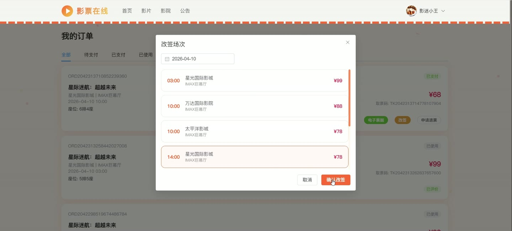

# (附文档)Springboot3+Vue3+MySQL 在线电影票务系统

**技术栈**：Springboot3、Vue3、MySQL

### 系统简介

本系统为一套基于 Spring Boot 3 + Vue 3 + MySQL 的在线电影票务系统，采用前后端分离架构。系统支持普通用户在线选座购票、影院管理员管理排片与订单、系统管理员进行全局配置与审核，同时提供优惠券、收藏、评价、签到记录等辅助功能。
 
### 核心功能
 
### 普通用户端

 
- 浏览电影列表（按状态筛选，如正在上映/即将上映），查看电影详情（评分、简介、演员等） 
- 查看影院列表（按城市筛选），查看影院详情（影厅列表、设施、营业时间） 
- 查询场次列表（按电影、影院、日期筛选），查看场次余座与价格 
- 进入选座页面，查看场次座位布局（已售座位高亮），选择座位后下单 
- 下单时选择优惠券抵扣（满减/折扣），选择收货地址用于配送（可选） 
- 支付订单（模拟支付），生成取票码；取消待支付订单 
- 提交退票申请（受系统配置的退票时限限制），查看退票审核结果 
- 提交改签申请（受改签时限限制），系统自动分配新场次座位 
- 查看我的订单列表（按状态筛选、按取票码搜索），查看订单详情（座位、场次信息） 
- 对已观影订单进行评价（评分+文字+图片），查看是否已评价 
- 收藏电影或影院，查看我的收藏列表（区分电影/影院），取消收藏 
- 领取优惠券，查看我的优惠券列表（未使用/已使用/已过期） 
- 管理收货地址（新增/编辑/删除/设为默认），地址信息含省市区详细地址 
- 修改个人资料（昵称、头像、手机号、邮箱），修改登录密码（需验证原密码） 
- 查看系统公告列表（仅显示已发布的公告）
 
### 影院管理员端

 
- 管理本影院电影（新增/编辑/下架），新增电影时审核状态默认为待审核 
- 管理本影院影厅（新增/编辑/删除），设置座位行列数、影厅类型 
- 管理本影院场次（新增/编辑/删除），设置价格（受系统票价上下限限制）、时间 
- 查看本影院订单列表（按状态筛选、按取票码搜索），查看订单详情 
- 核销订单（检票），记录检票日志（含操作人、时间、场次信息） 
- 审核退票申请（同意/拒绝），拒绝后订单恢复为已支付状态 
- 管理本影院优惠券（新增/编辑/删除），新增时自动发放给所有正常用户 
- 查看本影院评价列表，回复用户评价 
- 查看本影院数据统计（今日销售额、本月销售额、今日观影人次、总观影人次、近30天趋势图、月度趋势图、热门电影排行、上座率） 
- 查看本影院检票日志列表（按影院名称筛选）
 
### 系统管理员端

 
- 管理所有用户（新增/编辑/删除/启用/禁用），支持按角色和用户名搜索 
- 审核影院管理员注册申请（通过/拒绝），管理用户状态（正常/禁用/审核中） 
- 管理所有影院（新增/编辑/删除），查看影院详情 
- 管理所有电影（新增/编辑/删除），审核电影上架（通过/驳回） 
- 管理所有订单（查看详情、更新状态），查看全平台订单统计 
- 管理系统配置项（新增/编辑），如票价上下限、退票时限、改签时限等，配置修改后实时生效 
- 查看系统操作日志（按类型筛选），记录用户操作详情 
- 发布/编辑/删除系统公告，控制公告发布状态 
- 查看全平台数据看板（今日销售额、总销售额、总出票数、用户数、电影数、影院数、近7天销售趋势、近30天用户增长、热门电影排行） 
- 查看指定影院的独立数据统计（销售额、观影人次、趋势图、上座率）
 
### 技术栈

  后端框架 Spring Boot 3   ORM MyBatis-Plus   权限认证 JWT (jjwt)   前端框架 Vue 3   状态管理 Pinia   构建工具 Vite   数据库 MySQL   工具库 Hutool、Lombok 
 
### 交付内容

 
- 后端完整源码 
- 前端完整源码 
- 数据库初始化脚本 
- 万字文档

## 界面展示

---

## 获取完整源码 + 万字文档

本仓库为项目介绍页。**完整前后端源码、数据库初始化脚本、万字项目文档**，请加微信 `kangkangcode`，或访问 [codekk.top](http://codekk.top) 获取。

可作课程设计 / 毕业设计参考，支持远程部署调试。